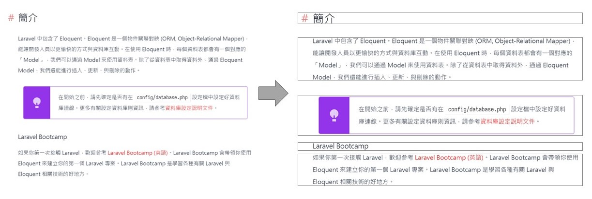

# 網頁截圖裁剪工具

這是一個簡單的工具，用於處理網頁截圖，將連續的空白區域裁剪成多張圖片。

## 安裝

確保你已經安裝了所需的 Python 庫。你可以使用以下指令進行安裝：

```bash
pip install Pillow numpy
```

## 用法

執行腳本檔案，使用以下指令：

```bash
python main.py --input_file <輸入檔案路徑> --output_path <輸出資料夾路徑>
```
可選參數：

--input_file：指定輸入的網頁截圖檔案路徑，預設為 'sample.png'。
--output_path：指定輸出裁剪後圖片的資料夾路徑，預設為 'save' 資料夾。
### 範例
```bash
python main.py --input_file example.png --output_path output
```
這個範例將處理名為 'example.png' 的網頁截圖，並將裁剪後的圖片保存到 'output' 資料夾。
## 注意事項
確保輸入檔案是有效的網頁截圖。
輸出資料夾路徑應該存在，否則將會出現錯誤。